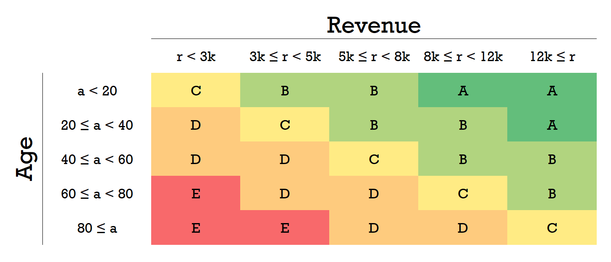
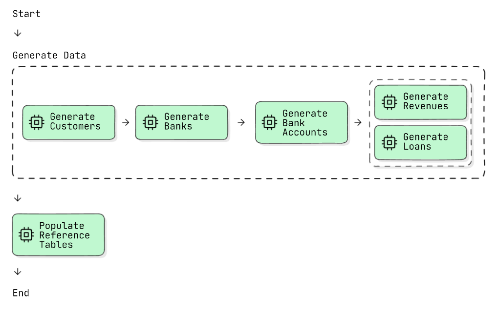
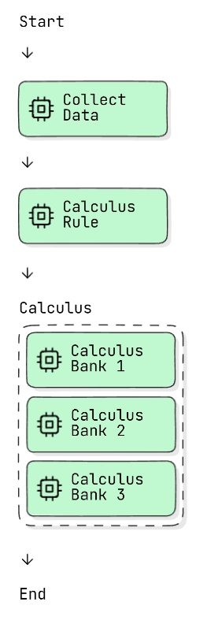

# Customer Processor

## About

The Customer Processor is a Spring Batch application designed to simulate batch processing for a financial company. The
primary purpose is to calculate the fees and debts of all customers loans based on several rules.

This project delivers
a solution for handling large datasets, enforcing business rules, and integrating with a database.

## Technologies Used

- Spring Boot
- Spring Batch
- Kotlin
- Docker
- Microsoft SQL Server
- Swagger

## How to Run the Project

### Prerequisites

- Docker
- Docker Compose

### Steps to Run

1. **Clone the Repository:**

   ```bash
   git clone https://github.com/brunnooliver7/customer-processor.git
   cd customer-processor
   ```

2. **Run `build.sh` or `build.ps1`:**

   ```bash
   build.sh
   ```
   ```bash
   build.ps1
   ```

This script will mount the image specified in `Dockerfile` and then run the containers specified in `docker-compose`

### Running Jobs

> By default, the jobs will not run automatically on application startup.

To trigger batch jobs, you can use the provided endpoints:

1. **Trigger `DataJob`:**

```bash
curl -X POST http://localhost:8080/api/data-job
```

2. **Trigger `CustomerJob`:**

```bash
curl -X POST http://localhost:8080/api/customer-job
```

## Process Overview

In the context of a financial company, there may be several schemas with several tables. In this project, we will
simulate this scenario.

### DataJob

First, we need to generate the data that will be consumed in the batch processing. This data will be referenced
as `external data` and it represents the data along the schemas of the company database. The generation of this data is
processed by the first job `DataJob`. These are the generated external data:

- Customer
- Bank
- Bank Account
- Revenue
- Loan

In resources folder there are some .csv files that were prepared to provide the fake data to be generated in `DataJob`.
These .csv data will be used to create 1M customers. In the `Generate Loans Step`, it's assumed that each customer can
have 0 to 3 loans with the company. Therefore, as the average of these values is equal to 1.5 and the random generation
of data is normally distributed, approximately 1.5M loans will be generated. Also, we can assume that the customers are
associated with one of 3 major banks (this will affect the design of calculus step).

With the generated data, we need to check which calculation rule must be applied to each register. These rules are
stored in reference tables:

- Debt Delay
- Risk
- Percentage
- Rule

The result of the rules is the `percentage`, that will be used in the calculus of debts. To
determine the value of the percentage, we must evaluate the `risk` and the `debt delay` of the loan, as the following
image:

<div style="display: flex; justify-content: center">
   <div style="max-width: 700px">
       
   </div>
</div>

<br/>

The `risk` is defined based on the `revenue` and the `age` of the customer:

<div style="display: flex; justify-content: center">
   <div style="max-width: 700px">
       
   </div>
</div>

<br/>

The `rule` table define the relations between `debt delay`, `risk` and `percentage`.

The generation of external data and population of reference tables are processed in `DataJob`:

<div style="display: flex; justify-content: center">
   <div style="max-width: 700px">
       
   </div>
</div>

> The image represent the batch job, each green block represents a step and the dashed lines represents a flow. Steps
> contained in the same flow runs in parallel, to increase performance.

### CustomerJob

Once we have the generated external data and reference tables populated, we can move on to the main job `CustomerJob`.

First, we need to gather the simulated external data to a table in our schema designed for that called `external_data`,
in `Collect Data` step.

Then, the process moves to the `Calculus Rule` step to evaluate the rules that should be applied for each loan.
The data of this evaluation are stored in the `calculus_rule` table, which makes the map of each loan and the respective
rule to be applied in the calculus.

Finally, we can apply the rules to calculate the fee and the current debt of the customer loan. Since we are assuming
that all customers are associated with one of 3 major banks, we can process the data of each bank in parallel steps to
increase performance.

<div style="display: flex; justify-content: center">
   <div style="max-width: 200px">
       
   </div>
</div>

## Database Tables

The database tables have been modeled as follows:

#### Batch Tables: These are the tables used by the Spring Batch library to manage the execution of jobs:

- `BATCH_JOB_EXECUTION`
- `BATCH_JOB_EXECUTION_CONTEXT`
- `BATCH_JOB_EXECUTION_PARAMS`
- `BATCH_JOB_EXECUTION_SEQ`
- `BATCH_JOB_INSTANCE`
- `BATCH_JOB_SEQ`
- `BATCH_STEP_EXECUTION`
- `BATCH_STEP_EXECUTION_CONTEXT`
- `BATCH_STEP_EXECUTION_SEQ`

#### Reference Tables: These tables contain the parameters for the calculation rules. The `rule` table gathers these parameters, and each record in this table represents a rule to be applied in the calculation.

- `debt_delay`
- `percentage`
- `risk`
- `rule`

#### Dynamic Tables: These tables are used to record the data generated by batch processing:

- `external_data`
- `calculus_rule`
- `calculus`
